# Design Document: Pajak / SPT Tahunan

## Overview

Halaman "Pajak / SPT Tahunan" adalah fitur komprehensif yang memungkinkan pengguna menghitung estimasi pajak SPT Tahunan Orang Pribadi secara otomatis berdasarkan data transaksi yang telah dicatat sepanjang tahun. Fitur ini mendukung dua metode perhitungan (Laba Bersih/Progresif dan UMKM Final 0,5%), dengan kemampuan ekspor PDF dan copy summary. Desain menggunakan dark premium theme (#090C12) dengan glassmorphism style, mobile-first responsive, dan terintegrasi penuh dengan database existing.

## Architecture Overview

```mermaid
graph TD
    A[Tax Page] --> B[Tax Settings Card]
    A --> C[Hero Summary Card]
    A --> D[Calculation Summary]
    A --> E[Income Details]
    A --> F[Expense Details]
    A --> G[Tax Breakdown]
    A --> H[Assets & Liabilities]
    A --> I[Export & Copy Actions]
    
    B --> B1[Year Selection]
    B --> B2[PTKP Status]
    B --> B3[Calculation Method]
    
    D --> D1[Database Query]
    D --> D2[Calculation Engine]
    D --> D3[Format Display]
    
    E --> E1[Get Income Transactions]
    E --> E2[Group by Category]
    E --> E3[Display Table]
    
    F --> F1[Get Expense Transactions]
    F --> F2[Group by Category]
    F --> F3[Display Table]
    
    G --> G1[Progressive Tax Calc]
    G --> G2[UMKM Final Tax Calc]
    G --> G3[Display Breakdown]
    
    H --> H1[Get Cars]
    H --> H2[Get Debts]
    H --> H3[Get Investments]
    
    I --> I1[PDF Generator]
    I --> I2[Copy to Clipboard]
```



## Database Schema

### New Tables

#### tax_settings
```sql
CREATE TABLE tax_settings (
  id UUID PRIMARY KEY DEFAULT gen_random_uuid(),
  user_id UUID NOT NULL REFERENCES users(id) ON DELETE CASCADE,
  tax_year INT NOT NULL,
  ptkp_status VARCHAR(10) NOT NULL, -- TK/0, TK/1, TK/2, TK/3, K/0, K/1, K/2, K/3
  calculation_method VARCHAR(50) NOT NULL, -- 'progressive' or 'umkm_final'
  manual_pph21_withheld DECIMAL(18,2) DEFAULT 0,
  manual_commission_tax_withheld DECIMAL(18,2) DEFAULT 0,
  manual_tax_paid DECIMAL(18,2) DEFAULT 0,
  notes TEXT,
  created_at TIMESTAMP DEFAULT CURRENT_TIMESTAMP,
  updated_at TIMESTAMP DEFAULT CURRENT_TIMESTAMP,
  UNIQUE(user_id, tax_year)
);
```

#### tax_report_snapshots
```sql
CREATE TABLE tax_report_snapshots (
  id UUID PRIMARY KEY DEFAULT gen_random_uuid(),
  user_id UUID NOT NULL REFERENCES users(id) ON DELETE CASCADE,
  tax_year INT NOT NULL,
  report_json JSONB NOT NULL,
  created_at TIMESTAMP DEFAULT CURRENT_TIMESTAMP,
  updated_at TIMESTAMP DEFAULT CURRENT_TIMESTAMP,
  UNIQUE(user_id, tax_year)
);
```

### Existing Tables Used
- **Transaction**: Income/Expense transactions with category
- **Category**: Category type (INCOME/EXPENSE)
- **Account**: User accounts for balance tracking
- **Car**: Vehicle data for asset calculation
- **Debt**: Debt/Receivable data
- **InvestmentSnapshot**: Investment data

## Helper Functions & Utilities

### File: `lib/tax-helpers.ts`

```typescript
// Format currency to Rupiah
export function formatRupiah(amount: number): string

// Get all transactions for a specific year
export async function getTaxYearTransactions(
  userId: string, 
  year: number
): Promise<Transaction[]>

// Get income grouped by category
export async function getIncomeByCategory(
  userId: string, 
  year: number
): Promise<Map<string, number>>

// Get expense grouped by category
export async function getExpenseByCategory(
  userId: string, 
  year: number
): Promise<Map<string, number>>

// Get current account balances
export async function getAccountBalances(
  userId: string
): Promise<Map<string, number>>

// Get assets summary (cars, investments)
export async function getAssetsSummary(
  userId: string, 
  year: number
): Promise<{
  cars: Array<{id, name, estimatedValue}>
  investments: Array<{category, balance}>
}>

// Get debt and receivable summary
export async function getDebtReceivableSummary(
  userId: string
): Promise<{
  debts: Array<{name, remainingAmount}>
  receivables: Array<{name, amount}>
}>

// Calculate PTKP value based on status
export function calculatePTKP(ptkpStatus: string): number

// Calculate progressive tax for given PKP
export function calculateProgressiveTax(pkp: number): {
  totalTax: number
  breakdown: Array<{
    layer: string
    rate: number
    taxableAmount: number
    tax: number
  }>
}

// Calculate UMKM final tax (0.5%)
export function calculateUMKMFinalTax(bruto: number): {
  totalTax: number
  basis: number
}

// Calculate complete tax summary
export async function calculateTaxSummary(
  userId: string,
  year: number,
  ptkpStatus: string,
  method: 'progressive' | 'umkm_final',
  taxPaid: number
): Promise<TaxSummary>

// Generate PDF report
export async function generateTaxPDF(
  reportData: TaxSummary,
  userName: string,
  year: number
): Promise<Buffer>
```

### File: `lib/tax-calculations.ts`

```typescript
// PTKP values mapping
const PTKP_VALUES: Record<string, number> = {
  'TK/0': 54_000_000,
  'TK/1': 58_500_000,
  'TK/2': 63_000_000,
  'TK/3': 67_500_000,
  'K/0': 58_500_000,
  'K/1': 63_000_000,
  'K/2': 67_500_000,
  'K/3': 72_000_000,
}

// Progressive tax brackets
const TAX_BRACKETS = [
  { min: 0, max: 60_000_000, rate: 0.05 },
  { min: 60_000_000, max: 250_000_000, rate: 0.15 },
  { min: 250_000_000, max: 500_000_000, rate: 0.25 },
  { min: 500_000_000, max: 5_000_000_000, rate: 0.30 },
  { min: 5_000_000_000, max: Infinity, rate: 0.35 },
]

// Calculate tax for each bracket
export function calculateTaxByBracket(pkp: number): TaxBreakdown[]

// Calculate net income
export function calculateNetIncome(
  totalIncome: number,
  totalExpense: number
): number

// Calculate PKP
export function calculatePKP(
  netIncome: number,
  ptkp: number
): number

// Calculate tax status
export function calculateTaxStatus(
  taxDue: number,
  taxPaid: number
): 'kurang_bayar' | 'lebih_bayar' | 'nihil'

// Calculate difference
export function calculateTaxDifference(
  taxDue: number,
  taxPaid: number
): number
```

## UI/UX Design

### Design System

**Color Palette:**
- Primary Background: #090C12 (dark premium)
- Glass Effect: rgba(255, 255, 255, 0.08)
- Income Color: #42D97B (green)
- Expense Color: #F05C6B (red)
- Warning Color: #F59E0B (amber)
- Success Color: #10B981 (emerald)
- Text Primary: #FFFFFF
- Text Muted: rgba(255, 255, 255, 0.6)

**Typography:**
- Headings: font-black (900 weight)
- Body: font-normal
- Labels: font-semibold

**Components:**
- Glass cards with border: `glass-premium rounded-3xl p-6 border border-white/10`
- Soft cards: `soft-card rounded-2xl p-4 border border-premium-border-soft`
- Buttons: Primary (btn btn-primary), Ghost (btn btn-ghost)
- Badges: Status indicators with color coding

### Page Layout Structure

```
┌─────────────────────────────────────────┐
│ Header (Title + Subtitle)               │
├─────────────────────────────────────────┤
│ Tax Settings Card                       │
│ ├─ Year Selection                       │
│ ├─ PTKP Status Dropdown                 │
│ └─ Calculation Method Toggle            │
├─────────────────────────────────────────┤
│ Hero Summary Card (Large)               │
│ ├─ Estimated PPh                        │
│ ├─ Tax Status (Color Coded)             │
│ ├─ Tax Year                             │
│ └─ PTKP Status                          │
├─────────────────────────────────────────┤
│ Calculation Summary Table               │
│ ├─ Total Income                         │
│ ├─ Total Expense                        │
│ ├─ Net Income                           │
│ ├─ PTKP                                 │
│ ├─ PKP                                  │
│ ├─ PPh Due                              │
│ ├─ Tax Paid                             │
│ └─ Difference                           │
├─────────────────────────────────────────┤
│ Income Details by Category              │
│ ├─ Category | Count | Total             │
│ └─ Special: Profit Mobil Section        │
├─────────────────────────────────────────┤
│ Expense Details by Category             │
│ ├─ Category | Count | Total             │
├─────────────────────────────────────────┤
│ Tax Breakdown (Method Specific)         │
│ ├─ Progressive: Breakdown per Layer     │
│ └─ UMKM: Final Tax Calculation          │
├─────────────────────────────────────────┤
│ Assets & Liabilities                    │
│ ├─ Assets (Cars, Investments)           │
│ ├─ Debts                                │
│ └─ Receivables                          │
├─────────────────────────────────────────┤
│ Export & Copy Actions                   │
│ ├─ Export PDF Button                    │
│ └─ Copy Summary Button                  │
├─────────────────────────────────────────┤
│ Disclaimer                              │
└─────────────────────────────────────────┘
```

## Component Structure

### File: `app/(app)/tax/page.tsx`

Main page component that orchestrates all sections and data fetching.

### File: `components/tax-settings-card.tsx`

Settings card with:
- Year selector (dropdown with current year default)
- PTKP status selector (8 options)
- Calculation method toggle (Progressive/UMKM)
- Auto-save to database

### File: `components/tax-summary-card.tsx`

Hero summary card displaying:
- Large PPh amount with color coding
- Tax status badge (Kurang Bayar/Lebih Bayar/Nihil)
- Tax year and PTKP status
- Visual indicators for status

### File: `components/tax-breakdown.tsx`

Conditional component showing:
- Progressive tax breakdown table (if method = progressive)
- UMKM final tax calculation (if method = umkm_final)

### File: `components/tax-details-table.tsx`

Reusable table component for:
- Calculation summary
- Income by category
- Expense by category
- Tax breakdown

### File: `components/tax-pdf-generator.ts`

PDF generation utility using jsPDF/pdfkit:
- Generate professional PDF report
- Include all sections
- Apply dark theme styling
- Return downloadable file

## Calculation Logic

### Progressive Tax Method (Laba Bersih/Progresif OP)

```
1. Total Income = Sum of all INCOME transactions for year
2. Total Expense = Sum of all EXPENSE transactions for year
3. Net Income = max(0, Total Income - Total Expense)
4. PTKP = PTKP_VALUES[ptkpStatus]
5. PKP = max(0, Net Income - PTKP)
6. PPh Terutang = Calculate using tax brackets:
   - 0-60M: PKP × 5%
   - 60M-250M: 60M × 5% + (PKP - 60M) × 15%
   - 250M-500M: 60M × 5% + 190M × 15% + (PKP - 250M) × 25%
   - 500M-5B: 60M × 5% + 190M × 15% + 250M × 25% + (PKP - 500M) × 30%
   - >5B: 60M × 5% + 190M × 15% + 250M × 25% + 4.5B × 30% + (PKP - 5B) × 35%
7. Tax Paid = manual_tax_paid (from settings)
8. Difference = PPh Terutang - Tax Paid
   - If > 0: Kurang Bayar
   - If < 0: Lebih Bayar
   - If = 0: Nihil
```

### UMKM Final Tax Method (0,5%)

```
1. Bruto Usaha = Sum of all INCOME transactions for year
2. Basis = max(0, Bruto Usaha - 500_000_000)
3. PPh Final = Basis × 0.5%
4. Tax Paid = manual_tax_paid (from settings)
5. Difference = PPh Final - Tax Paid
   - If > 0: Kurang Bayar
   - If < 0: Lebih Bayar
   - If = 0: Nihil
```

### Special Handling: Profit Mobil

- Kategori "Profit Mobil" langsung dianggap sebagai penghasilan bersih
- Tidak perlu input harga jual mobil
- Ditampilkan dalam section khusus "Detail Profit Mobil Khusus"
- Tetap dimasukkan dalam total pemasukan untuk perhitungan pajak

## API Endpoints

### GET /api/tax/summary

Fetch tax calculation summary for a specific year.

**Query Parameters:**
- `year`: Tax year (number)

**Response:**
```json
{
  "totalIncome": 500000000,
  "totalExpense": 100000000,
  "netIncome": 400000000,
  "ptkp": 54000000,
  "pkp": 346000000,
  "pphDue": 51900000,
  "taxPaid": 0,
  "difference": 51900000,
  "status": "kurang_bayar",
  "incomeByCategory": {...},
  "expenseByCategory": {...},
  "taxBreakdown": [...]
}
```

### POST /api/tax/settings

Save or update tax settings.

**Request Body:**
```json
{
  "taxYear": 2024,
  "ptkpStatus": "TK/0",
  "calculationMethod": "progressive",
  "manualTaxPaid": 0,
  "notes": "Optional notes"
}
```

**Response:**
```json
{
  "id": "uuid",
  "userId": "uuid",
  "taxYear": 2024,
  "ptkpStatus": "TK/0",
  "calculationMethod": "progressive",
  "manualTaxPaid": 0,
  "createdAt": "2024-01-01T00:00:00Z",
  "updatedAt": "2024-01-01T00:00:00Z"
}
```

### GET /api/tax/report

Fetch complete tax report for PDF export.

**Query Parameters:**
- `year`: Tax year (number)

**Response:**
```json
{
  "year": 2024,
  "userName": "John Doe",
  "settings": {...},
  "summary": {...},
  "details": {...}
}
```

### POST /api/tax/export-pdf

Generate and download PDF report.

**Request Body:**
```json
{
  "year": 2024
}
```

**Response:** PDF file download

## File Structure

```
app/
├── (app)/
│   └── tax/
│       └── page.tsx                    # Main tax page
│
components/
├── tax-settings-card.tsx               # Settings card component
├── tax-summary-card.tsx                # Hero summary card
├── tax-breakdown.tsx                   # Tax breakdown display
├── tax-details-table.tsx               # Reusable table component
└── tax-pdf-generator.ts                # PDF generation utility
│
lib/
├── tax-helpers.ts                      # Helper functions
├── tax-calculations.ts                 # Calculation logic
└── tax-actions.ts                      # Server actions
│
app/api/tax/
├── summary/route.ts                    # GET /api/tax/summary
├── settings/route.ts                   # POST /api/tax/settings
├── report/route.ts                     # GET /api/tax/report
└── export-pdf/route.ts                 # POST /api/tax/export-pdf
```

## Performance Considerations

### Caching Strategy

1. **Transaction Data Caching**
   - Cache transaction queries for 5 minutes
   - Invalidate on new transaction creation
   - Use React Query or SWR for client-side caching

2. **Calculation Caching**
   - Cache tax calculations for 1 hour
   - Store in tax_report_snapshots table
   - Invalidate when settings change

3. **Database Query Optimization**
   - Use indexes on (userId, date) for transactions
   - Use indexes on (userId, type) for category filtering
   - Batch queries where possible

### Lazy Loading

- Load income/expense details on demand
- Defer PDF generation to background job
- Use pagination for large transaction lists

### Query Optimization

```sql
-- Optimized query for income by category
SELECT 
  c.name,
  COUNT(t.id) as count,
  SUM(t.amount) as total
FROM transactions t
JOIN categories c ON t.category_id = c.id
WHERE t.user_id = $1 
  AND t.type = 'INCOME'
  AND EXTRACT(YEAR FROM t.date) = $2
GROUP BY c.id, c.name
ORDER BY total DESC;
```

## Error Handling & Validation

### Input Validation

1. **Tax Year Validation**
   - Must be between 1900 and current year + 1
   - Must be integer

2. **PTKP Status Validation**
   - Must be one of: TK/0, TK/1, TK/2, TK/3, K/0, K/1, K/2, K/3

3. **Tax Paid Validation**
   - Must be >= 0
   - Must be number
   - Show error if negative

4. **Calculation Method Validation**
   - Must be 'progressive' or 'umkm_final'

### Error States

- No transactions for year: Show empty state with message
- Database error: Show error toast with retry option
- PDF generation error: Show error message and fallback to copy summary
- Invalid settings: Show validation error messages

### Empty States

- No income: Display "Belum ada pemasukan untuk tahun ini"
- No expense: Display "Belum ada pengeluaran untuk tahun ini"
- No transactions: Display comprehensive empty state with action

## Testing Strategy

### Unit Tests

**File: `lib/__tests__/tax-calculations.test.ts`**

Test cases:
- `calculatePTKP()`: All 8 PTKP statuses
- `calculateProgressiveTax()`: Various PKP amounts
- `calculateUMKMFinalTax()`: Various bruto amounts
- `calculateNetIncome()`: Positive, negative, zero cases
- `calculatePKP()`: Edge cases (income < PTKP)
- `calculateTaxStatus()`: All three statuses

### Integration Tests

**File: `lib/__tests__/tax-helpers.integration.test.ts`**

Test cases:
- `getTaxYearTransactions()`: Correct filtering by year
- `getIncomeByCategory()`: Correct grouping and aggregation
- `getExpenseByCategory()`: Correct grouping and aggregation
- `calculateTaxSummary()`: Complete workflow

### E2E Tests

**File: `e2e/tax.spec.ts`**

Test scenarios:
1. User opens tax page → Settings loaded with current year
2. User changes PTKP status → Calculations update
3. User changes calculation method → Display updates
4. User enters tax paid → Difference recalculates
5. User exports PDF → File downloads
6. User copies summary → Text in clipboard

### Property-Based Tests

**File: `lib/__tests__/tax-calculations.pbt.test.ts`**

Using fast-check library:

```typescript
// Property 1: PPh Terutang >= 0
fc.assert(
  fc.property(fc.integer({min: 0, max: 10_000_000_000}), (pkp) => {
    const result = calculateProgressiveTax(pkp);
    return result.totalTax >= 0;
  })
);

// Property 2: PKP = max(0, NetIncome - PTKP)
fc.assert(
  fc.property(
    fc.integer({min: 0, max: 10_000_000_000}),
    fc.integer({min: 0, max: 100_000_000}),
    (netIncome, ptkp) => {
      const pkp = calculatePKP(netIncome, ptkp);
      return pkp === Math.max(0, netIncome - ptkp);
    }
  )
);

// Property 3: Difference = PPh - TaxPaid
fc.assert(
  fc.property(
    fc.integer({min: 0, max: 100_000_000}),
    fc.integer({min: 0, max: 100_000_000}),
    (pphDue, taxPaid) => {
      const diff = calculateTaxDifference(pphDue, taxPaid);
      return diff === pphDue - taxPaid;
    }
  )
);

// Property 4: Total Income = Sum(categories)
fc.assert(
  fc.property(
    fc.array(fc.integer({min: 0, max: 1_000_000_000}), {minLength: 1}),
    (amounts) => {
      const total = amounts.reduce((a, b) => a + b, 0);
      return total === amounts.reduce((a, b) => a + b, 0);
    }
  )
);

// Property 5: Total Expense = Sum(categories)
fc.assert(
  fc.property(
    fc.array(fc.integer({min: 0, max: 1_000_000_000}), {minLength: 1}),
    (amounts) => {
      const total = amounts.reduce((a, b) => a + b, 0);
      return total === amounts.reduce((a, b) => a + b, 0);
    }
  )
);
```

## Correctness Properties

### Property 1: PPh Terutang >= 0
**Statement:** Pajak penghasilan yang terutang tidak boleh negatif
**Verification:** Untuk semua nilai PKP >= 0, hasil calculateProgressiveTax() harus >= 0

### Property 2: PKP = max(0, Penghasilan Neto - PTKP)
**Statement:** PKP adalah penghasilan neto dikurangi PTKP, dengan minimum 0
**Verification:** Untuk semua kombinasi netIncome dan PTKP, PKP harus sama dengan max(0, netIncome - PTKP)

### Property 3: Kurang/Lebih Bayar = PPh Terutang - Pajak Sudah Dibayar
**Statement:** Selisih pajak adalah PPh terutang dikurangi pajak yang sudah dibayar
**Verification:** Untuk semua kombinasi pphDue dan taxPaid, difference harus sama dengan pphDue - taxPaid

### Property 4: Total Pemasukan = Sum(kategori pemasukan)
**Statement:** Total pemasukan adalah jumlah dari semua kategori pemasukan
**Verification:** Untuk semua transaksi income, sum harus sama dengan total

### Property 5: Total Pengeluaran = Sum(kategori pengeluaran)
**Statement:** Total pengeluaran adalah jumlah dari semua kategori pengeluaran
**Verification:** Untuk semua transaksi expense, sum harus sama dengan total

## Security Considerations

1. **User Authorization**
   - Verify user owns the tax data being accessed
   - Use userId from session, not from request

2. **Input Sanitization**
   - Validate all numeric inputs
   - Sanitize text inputs for PDF generation
   - Prevent SQL injection via Prisma

3. **Data Privacy**
   - Tax data is sensitive financial information
   - Ensure HTTPS for all API calls
   - Don't log sensitive amounts
   - Implement rate limiting on API endpoints

4. **PDF Generation**
   - Validate PDF generation doesn't expose sensitive data
   - Ensure PDF is only accessible to authenticated user
   - Implement download token expiration

## Dependencies

### Frontend
- Next.js 14+ (App Router)
- TypeScript
- Tailwind CSS
- Lucide React (icons)
- React Query or SWR (caching)

### Backend
- Prisma ORM
- PostgreSQL (Neon)
- jsPDF or pdfkit (PDF generation)

### Testing
- Jest
- React Testing Library
- Playwright (E2E)
- fast-check (Property-based testing)

## Implementation Notes

1. **Database Migration**
   - Create tax_settings and tax_report_snapshots tables
   - Add indexes for performance
   - No changes to existing tables

2. **Backward Compatibility**
   - All existing features remain unchanged
   - New menu item added to navigation
   - No breaking changes to API

3. **Responsive Design**
   - Mobile-first approach
   - Stack sections vertically on mobile
   - Use grid layout on desktop
   - Test on various screen sizes

4. **Accessibility**
   - Use semantic HTML
   - Add ARIA labels where needed
   - Ensure color contrast meets WCAG standards
   - Support keyboard navigation

5. **Performance**
   - Implement caching strategy
   - Optimize database queries
   - Lazy load components
   - Monitor Core Web Vitals

## Disclaimer

Fitur ini hanya untuk estimasi. Untuk perhitungan pajak yang akurat, konsultasikan dengan konsultan pajak profesional. Hasil perhitungan mungkin berbeda dengan SPT resmi karena berbagai faktor yang tidak tercakup dalam sistem ini.
