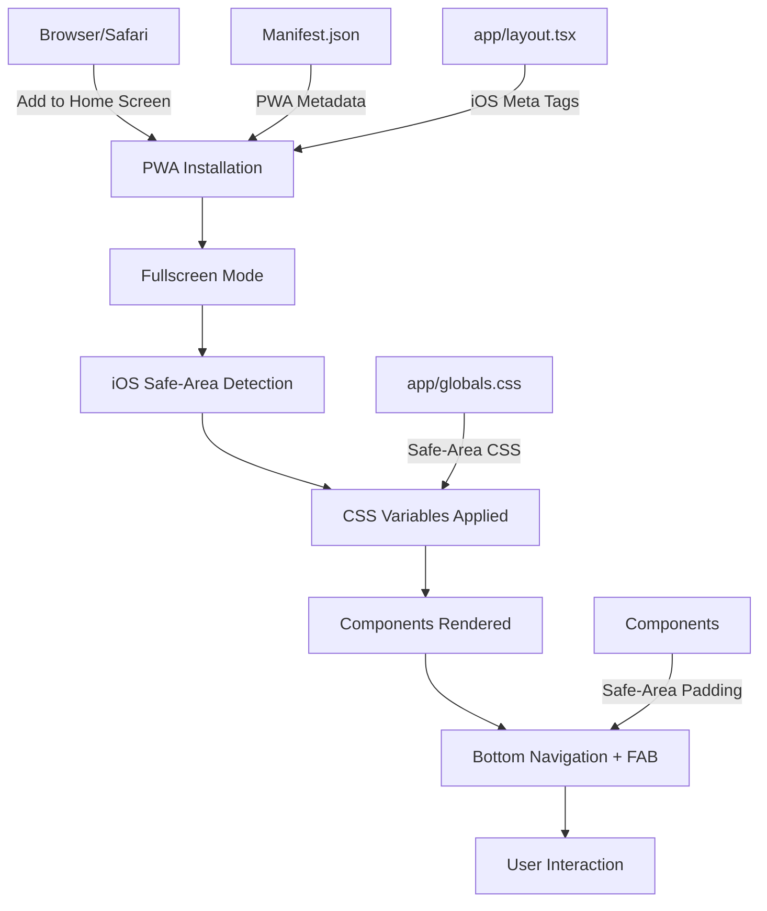

# Design Document: PWA iOS Implementation

## Overview

POS Finance Dashboard adalah aplikasi web yang dioptimalkan untuk pengalaman seperti aplikasi native iOS melalui Progressive Web App (PWA). Desain ini menjelaskan implementasi teknis untuk mendukung notch/Dynamic Island, home indicator, safe-area CSS, responsive design mobile-first, dan tema dark premium (#090C12). Implementasi menggunakan Next.js App Router dengan TypeScript, Tailwind CSS, dan Neon PostgreSQL, di-deploy di Vercel.

## Architecture Overview



## Icon Generation Strategy

### Icon Files Required

| File | Size | Purpose | Format |
|------|------|---------|--------|
| icon-192.png | 192x192px | Android/Web standard | PNG |
| icon-512.png | 512x512px | Splash screen, app store | PNG |
| icon-192-maskable.png | 192x192px | Android adaptive icon | PNG |
| icon-512-maskable.png | 512x512px | Android adaptive icon | PNG |
| apple-touch-icon.png | 180x180px | iOS Home Screen | PNG |
| shortcut-transaksi.png | 192x192px | App shortcut icon | PNG |
| shortcut-savings.png | 192x192px | App shortcut icon | PNG |
| screenshot-540.png | 540x720px | Narrow form factor | PNG |
| screenshot-1280.png | 1280x720px | Wide form factor | PNG |

### Generation Approach

**Option 1: Node.js + Sharp (Recommended)**
- Automated, reproducible, version-controlled
- Can be integrated into build pipeline
- Requires base image (SVG or high-res PNG)

**Option 2: Online Tool**
- https://realfavicongenerator.net/
- Manual but comprehensive
- Good for one-time generation

**Option 3: ImageMagick CLI**
- Command-line based
- Requires ImageMagick installation
- Good for batch processing

### Implementation Details

All icons use brand color #090C12 as background with white/light foreground. Maskable icons include safe zone (40% padding) for adaptive icon display on Android.

Location: `public/icons/` directory

## Metadata Configuration Details

### manifest.json Structure

```json
{
  "name": "POS Finance - Personal Finance & Bisnis Mobil",
  "short_name": "POS Finance",
  "description": "Dashboard keuangan pribadi dan tracking bisnis mobil dengan fitur lengkap",
  "start_url": "/dashboard",
  "scope": "/",
  "display": "fullscreen",
  "orientation": "portrait-primary",
  "theme_color": "#090C12",
  "background_color": "#090C12",
  "categories": ["finance", "productivity"],
  "icons": [...],
  "shortcuts": [...],
  "screenshots": [...]
}
```

**Key Configuration Points:**
- `display: "fullscreen"` - Hides Safari UI on iOS
- `orientation: "portrait-primary"` - Lock to portrait mode
- `theme_color: "#090C12"` - Status bar color
- `start_url: "/dashboard"` - Entry point after installation
- `scope: "/"` - All routes included in PWA scope

### app/layout.tsx Meta Tags

```typescript
export const metadata: Metadata = {
  manifest: '/manifest.json',
  appleWebApp: {
    capable: true,
    statusBarStyle: 'black-translucent',
    title: 'POS Finance',
  },
  viewport: {
    viewportFit: 'cover',  // Notch support
    width: 'device-width',
    initialScale: 1,
    maximumScale: 1,
    userScalable: false,
  },
  themeColor: '#090C12',
};
```

**Critical Meta Tags:**
- `apple-mobile-web-app-capable: yes` - Enable PWA on iOS
- `apple-mobile-web-app-status-bar-style: black-translucent` - Translucent status bar
- `viewport-fit: cover` - Extend content under notch
- `format-detection: telephone=false` - Prevent auto-linking phone numbers

## Safe-Area CSS Implementation

### CSS Variables Definition

```css
:root {
  --safe-area-inset-top: env(safe-area-inset-top, 0);
  --safe-area-inset-right: env(safe-area-inset-right, 0);
  --safe-area-inset-bottom: env(safe-area-inset-bottom, 0);
  --safe-area-inset-left: env(safe-area-inset-left, 0);
}
```

**How It Works:**
- `env()` function reads device safe-area values
- Fallback to 0 for devices without notch
- Automatically adapts to Dynamic Island on iPhone 14+
- Values update when device orientation changes

### Body Padding Application

```css
body {
  padding-bottom: var(--safe-area-inset-bottom);
  background: #090C12;
  color: #F1F3F7;
}
```

**Purpose:**
- Prevents content from being hidden by home indicator
- Ensures bottom navigation has space
- Maintains visual hierarchy

### Device-Specific Values

| Device | Top | Bottom | Notes |
|--------|-----|--------|-------|
| iPhone 12/13 (notch) | 47px | 34px | Standard notch |
| iPhone 14+ (Dynamic Island) | 47px | 34px | Larger notch area |
| iPhone SE (no notch) | 0px | 0px | Fallback values |
| iPad (no notch) | 0px | 0px | Fallback values |
| Android (no notch) | 0px | 0px | Fallback values |

## Component Modifications

### Bottom Navigation Safe-Area Implementation

**File:** `components/bottom-navigation.tsx`

```typescript
<nav 
  className="md:hidden fixed bottom-0 left-0 right-0 z-40"
  style={{ paddingBottom: 'var(--safe-area-inset-bottom)' }}
>
  <div className="flex items-center justify-around h-20 px-2">
    {/* Navigation items */}
  </div>
</nav>
```

**Key Points:**
- `md:hidden` - Only visible on mobile
- `fixed bottom-0` - Stays at bottom during scroll
- `paddingBottom: var(--safe-area-inset-bottom)` - Clears home indicator
- `z-index: 40` - Above main content
- Height: 80px (5rem) for navigation items + safe-area padding

### FAB Positioning with Safe-Area

**File:** `components/transaction-form.tsx`

```typescript
<button
  className="md:hidden fixed z-40 grid h-14 w-14 place-items-center rounded-full"
  style={{
    bottom: 'calc(1rem + var(--safe-area-inset-bottom) + 5rem)',
    right: '1rem',
  }}
>
  <Plus size={24} />
</button>
```

**Calculation Breakdown:**
- `1rem` - Margin from edge
- `var(--safe-area-inset-bottom)` - Home indicator clearance
- `5rem` - Bottom navigation height (80px)
- Total: FAB positioned above bottom nav with proper spacing

**Z-Index Hierarchy:**
- FAB: z-40
- Bottom Navigation: z-40
- Main Content: z-0 to z-30

## Testing Strategy

### Unit Testing Approach

**Safe-Area CSS Variables:**
- Verify CSS variables are defined in `:root`
- Verify fallback values (0) are applied
- Verify `env()` function syntax is correct

**Component Rendering:**
- Verify bottom navigation renders on mobile
- Verify FAB renders on mobile
- Verify both hidden on desktop (md:hidden)

**Metadata:**
- Verify manifest.json is valid JSON
- Verify all required fields present
- Verify icon paths are correct

### Property-Based Testing Approach

**Property Test Library:** fast-check (already in project via Next.js)

**Properties to Test:**

1. **Safe-Area Padding Consistency**
   - For any device safe-area value, body padding-bottom equals that value
   - For any screen size, bottom navigation padding-bottom equals safe-area value

2. **Z-Index Ordering**
   - FAB z-index >= Bottom Navigation z-index
   - Bottom Navigation z-index > Main Content z-index

3. **Responsive Breakpoints**
   - For viewport width < 768px: bottom navigation visible, desktop nav hidden
   - For viewport width >= 768px: desktop nav visible, bottom navigation hidden

4. **Icon File Existence**
   - All 9 icon files exist in public/icons/
   - All icon files are valid PNG format
   - Icon dimensions match specifications

### Integration Testing Approach

**Manual Testing on Real Devices:**

1. **iPhone Testing**
   - Open app in Safari
   - Tap Share → Add to Home Screen
   - Launch from Home Screen
   - Verify fullscreen mode (no Safari UI)
   - Verify notch clearance (content not hidden)
   - Verify home indicator clearance (bottom nav visible)
   - Verify FAB positioned above bottom nav
   - Test keyboard input (form doesn't break)
   - Test all navigation items
   - Test dark theme consistency

2. **Android Testing**
   - Open app in Chrome
   - Menu → Install app
   - Launch from Home Screen
   - Verify fullscreen mode
   - Verify adaptive icon display
   - Test app shortcuts
   - Test all features

3. **Desktop Testing**
   - Open in Chrome/Edge
   - Verify install prompt appears
   - Verify responsive layout
   - Verify bottom navigation hidden
   - Verify desktop navigation visible

### Verification Checklist

- [ ] All 9 icon files generated and placed in public/icons/
- [ ] manifest.json valid and complete
- [ ] app/layout.tsx has all required meta tags
- [ ] app/globals.css has safe-area CSS variables
- [ ] Bottom navigation has safe-area padding
- [ ] FAB positioned correctly above bottom nav
- [ ] npm run build succeeds without errors
- [ ] No TypeScript errors
- [ ] Tested on iPhone Safari (Add to Home Screen)
- [ ] Tested on Android Chrome (Install app)
- [ ] Tested on Desktop Chrome (Install app)
- [ ] Dark theme (#090C12) consistent across all pages
- [ ] Keyboard handling works correctly
- [ ] All existing features still functional
- [ ] Deployed to Vercel and accessible

## Performance Considerations

### Icon Optimization

- All icons compressed using PNG optimization
- Maskable icons include safe zone (40% padding)
- Icons cached by browser after first load
- Manifest.json cached by service worker

### CSS Performance

- Safe-area CSS variables computed once at load
- No JavaScript required for safe-area handling
- CSS variables fallback to 0 (no layout shift)
- Minimal CSS file size impact

### Build Performance

- Icon generation can be automated in build pipeline
- No additional dependencies required
- Build time impact: minimal (manifest.json already exists)
- Bundle size impact: negligible (only CSS variables added)

## Security Considerations

### PWA Security

- `scope: "/"` - All routes included in PWA scope
- `start_url: "/dashboard"` - Requires authentication (protected route)
- HTTPS required for PWA installation (Vercel provides this)
- Service worker not explicitly configured (Next.js handles this)

### Icon Security

- Icons served from public/icons/ (static assets)
- No sensitive information in icons
- Icons cached by browser (no repeated downloads)

### Manifest Security

- manifest.json is public (no sensitive data)
- Theme colors only (no credentials or tokens)
- Start URL points to authenticated route

## Deployment Checklist

### Pre-Deployment

- [ ] All 9 icon files generated
- [ ] manifest.json updated with correct icon paths
- [ ] app/layout.tsx has all meta tags
- [ ] app/globals.css has safe-area CSS variables
- [ ] Components updated with safe-area padding
- [ ] npm run build succeeds
- [ ] No TypeScript errors
- [ ] Local testing on iPhone/Android completed

### Deployment to Vercel

- [ ] Push code to repository
- [ ] Vercel automatically deploys
- [ ] Verify deployment successful
- [ ] Test on iPhone Safari (Add to Home Screen)
- [ ] Test on Android Chrome (Install app)
- [ ] Verify fullscreen mode works
- [ ] Verify safe-area clearance works
- [ ] Verify all features functional

### Post-Deployment

- [ ] Monitor error logs
- [ ] Verify icon loading in browser DevTools
- [ ] Verify manifest.json accessible at /manifest.json
- [ ] Test on multiple iPhone models
- [ ] Test on multiple Android devices
- [ ] Gather user feedback

## Dependencies

### Existing Dependencies (No New Additions Required)

- Next.js 14.2.16 - Framework
- React 18.3.1 - UI library
- TypeScript 5.6.3 - Type safety
- Tailwind CSS 3.4.15 - Styling
- Prisma 5.22.0 - Database ORM

### Optional Dependencies (For Icon Generation)

- **sharp** - For automated icon generation (optional)
- **imagemagick** - For CLI-based generation (optional)

### No Additional Dependencies Needed

- Safe-area CSS is native browser feature
- PWA metadata is standard HTML/JSON
- No service worker library needed (Next.js handles this)

## Implementation Timeline

### Phase 1: Icon Generation (1-2 hours)
- Generate 9 icon files
- Place in public/icons/
- Verify file sizes and formats

### Phase 2: Metadata Verification (30 minutes)
- Review manifest.json
- Review app/layout.tsx meta tags
- Verify all fields correct

### Phase 3: Safe-Area CSS Verification (30 minutes)
- Review app/globals.css
- Verify CSS variables defined
- Verify fallback values

### Phase 4: Component Verification (30 minutes)
- Review bottom-navigation.tsx
- Review transaction-form.tsx (FAB)
- Verify safe-area padding applied

### Phase 5: Build & Testing (1-2 hours)
- Run npm run build
- Test on iPhone Safari
- Test on Android Chrome
- Test on Desktop Chrome

### Phase 6: Deployment (30 minutes)
- Push to repository
- Verify Vercel deployment
- Final testing on production

**Total Estimated Time:** 4-6 hours

## Correctness Properties

### Property 1: Safe-Area Padding Applied
**Assertion:** For any device with safe-area insets, body padding-bottom equals safe-area-inset-bottom value

```typescript
// Pseudocode
FOR each device IN [iPhone12, iPhone14, iPhoneSE, iPad, Android]:
  ASSERT body.paddingBottom === device.safeAreaInsetBottom
```

### Property 2: Bottom Navigation Visibility
**Assertion:** Bottom navigation visible on mobile, hidden on desktop

```typescript
// Pseudocode
FOR each viewport IN [mobile, tablet, desktop]:
  IF viewport.width < 768px THEN
    ASSERT bottomNav.display === 'flex'
  ELSE
    ASSERT bottomNav.display === 'none'
```

### Property 3: FAB Positioning
**Assertion:** FAB positioned above bottom navigation with correct z-index

```typescript
// Pseudocode
ASSERT FAB.zIndex >= BottomNav.zIndex
ASSERT FAB.bottom > BottomNav.height + safeAreaInsetBottom
```

### Property 4: Icon Files Exist
**Assertion:** All 9 icon files exist in public/icons/ with correct dimensions

```typescript
// Pseudocode
FOR each icon IN [icon-192, icon-512, icon-192-maskable, icon-512-maskable, 
                   apple-touch-icon, shortcut-transaksi, shortcut-savings,
                   screenshot-540, screenshot-1280]:
  ASSERT fileExists(`public/icons/${icon}.png`)
  ASSERT getImageDimensions(`public/icons/${icon}.png`) === expectedDimension
```

### Property 5: Manifest Validity
**Assertion:** manifest.json is valid JSON with all required fields

```typescript
// Pseudocode
ASSERT isValidJSON(manifest.json)
ASSERT manifest.name !== empty
ASSERT manifest.short_name !== empty
ASSERT manifest.start_url !== empty
ASSERT manifest.display === 'fullscreen'
ASSERT manifest.theme_color === '#090C12'
```

### Property 6: Dark Theme Consistency
**Assertion:** All pages use background color #090C12

```typescript
// Pseudocode
FOR each page IN [dashboard, accounts, transactions, ...]:
  ASSERT page.backgroundColor === '#090C12'
  ASSERT page.textColor === '#F1F3F7'
```

### Property 7: Fullscreen Mode
**Assertion:** When launched from Home Screen, app displays in fullscreen mode

```typescript
// Pseudocode
WHEN app launched from Home Screen:
  ASSERT window.fullscreen === true
  ASSERT safariUI.visible === false
  ASSERT statusBar.visible === true
  ASSERT statusBar.style === 'black-translucent'
```

### Property 8: Keyboard Handling
**Assertion:** Keyboard input doesn't break form or hide submit button

```typescript
// Pseudocode
WHEN keyboard appears:
  ASSERT form.scrollable === true
  ASSERT submitButton.visible === true
  ASSERT submitButton.clickable === true
```

## Error Handling

### Icon Generation Errors

**Error:** Icon files not found in public/icons/
- **Response:** Build warning, PWA still functional but with default icon
- **Recovery:** Generate icons and rebuild

**Error:** Icon dimensions incorrect
- **Response:** Browser may display distorted icon
- **Recovery:** Regenerate icons with correct dimensions

### Metadata Errors

**Error:** manifest.json invalid JSON
- **Response:** PWA installation fails
- **Recovery:** Fix JSON syntax and redeploy

**Error:** Missing required manifest fields
- **Response:** PWA installation may fail or show incomplete info
- **Recovery:** Add missing fields to manifest.json

### Safe-Area CSS Errors

**Error:** CSS variables not defined
- **Response:** Content may be hidden by notch/home indicator
- **Recovery:** Verify app/globals.css has CSS variable definitions

**Error:** Safe-area padding not applied to components
- **Response:** Bottom navigation or FAB may be hidden
- **Recovery:** Verify components have safe-area padding applied

### Build Errors

**Error:** TypeScript compilation error
- **Response:** Build fails, deployment blocked
- **Recovery:** Fix TypeScript errors and rebuild

**Error:** Missing dependencies
- **Response:** Build fails
- **Recovery:** Install missing dependencies with npm install

## Verification Methods

### Code Review Checklist

- [ ] manifest.json has all required fields
- [ ] app/layout.tsx has all meta tags
- [ ] app/globals.css has CSS variables
- [ ] Bottom navigation has safe-area padding
- [ ] FAB has correct positioning calculation
- [ ] All icon paths correct in manifest.json
- [ ] No TypeScript errors
- [ ] No console errors in browser

### Browser DevTools Verification

- [ ] Manifest.json loads correctly (Application tab)
- [ ] Icons display in manifest (Application tab)
- [ ] CSS variables computed correctly (Styles tab)
- [ ] Safe-area values correct (Computed styles)
- [ ] No console errors or warnings

### Device Testing Verification

- [ ] iPhone: Add to Home Screen works
- [ ] iPhone: Fullscreen mode displays
- [ ] iPhone: Notch clearance works
- [ ] iPhone: Home indicator clearance works
- [ ] iPhone: Bottom navigation visible
- [ ] iPhone: FAB positioned correctly
- [ ] Android: Install app works
- [ ] Android: Adaptive icon displays
- [ ] Desktop: Install prompt appears

## Summary

This design document provides a comprehensive technical approach to implementing PWA iOS support for POS Finance Dashboard. The implementation leverages existing Next.js infrastructure, adds safe-area CSS variables, updates component styling, and generates required icon assets. No new dependencies are required, and all changes are backward-compatible with existing functionality.

The design ensures:
- ✅ Seamless iOS experience with notch/Dynamic Island support
- ✅ Proper home indicator clearance
- ✅ Responsive mobile-first design
- ✅ Dark theme consistency (#090C12)
- ✅ Keyboard handling for forms
- ✅ Cross-platform compatibility (iOS, Android, Desktop)
- ✅ No regression in existing features
- ✅ Production-ready deployment to Vercel
